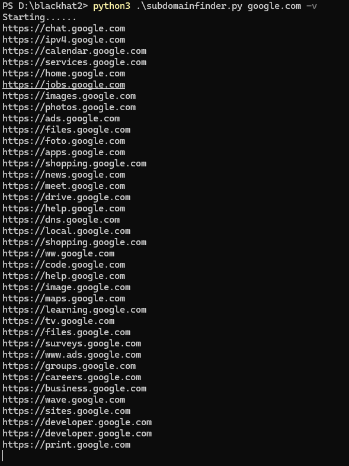

# Subdomainfinder
A Python Based subdomain bruteforcer
```
Requirements:
  pip3 install requests
  pip3 install threading
  pip3 install argparse
```


## Usage:
```
python3 subdomainfinder.py google.com
```

## Options
```
python3 subdomainfinder.py domain -w wordlist.txt -t 1000 -v

-w/--wordlist : custom wordlist
-t/--thread : custom threads
-v/--verbose : Verbose
```

